# learning_log

Learning Log web app (built with django and bootstrap) helps users record and 
review materials being learned in the 'topic-entry' format.

Entries can be edited after creation. Entries are
associated with a particular topic and can only be accessed within this topic.
Topics are available only to their creators. For now, there are no materials
available to unauthenticated users.

Therefore, website requires visitors to register/log in to be able to review or
create their topics/entries.

Logout functionality, as well as admin user are also implemented.

Last but not least, the web app has customized error handling for common errors.

Learning Log is ready for deployment on https://www.heroku.com/

It is important to note that Heroku hosting is currently paid-only. Furthermore, 
'heroku-postgresql' (aka Heroku Postgres) paid addon is required on the side of 
Heroku for PostgreSQL database to work.

<div align=center margin=auto> 
  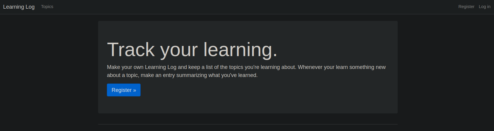
</div>

<div align=center margin=auto> 
  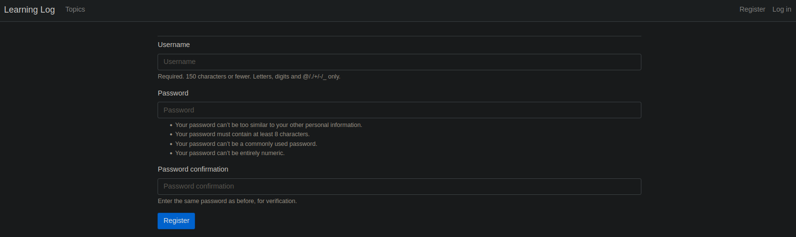
</div>

<div align=center margin=auto> 
  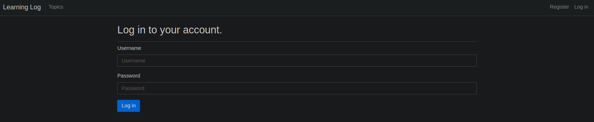
</div>

<div align=center margin=auto> 
  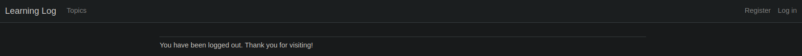
</div>

<div align=center margin=auto> 
  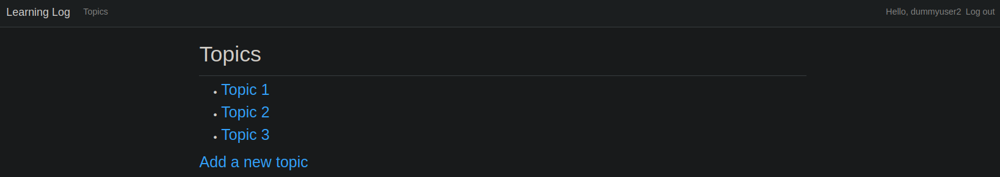
</div>

<div align=center margin=auto> 
  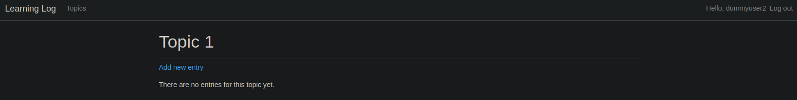
</div>

<div align=center margin=auto> 
  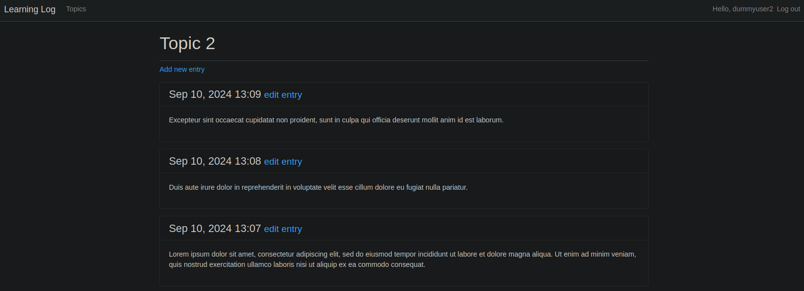
</div>

<div align=center margin=auto> 
  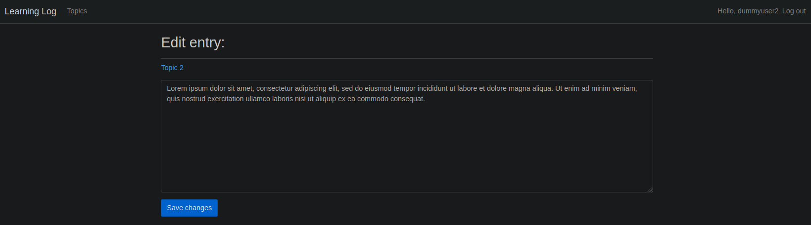
</div>

<div align=center margin=auto> 
  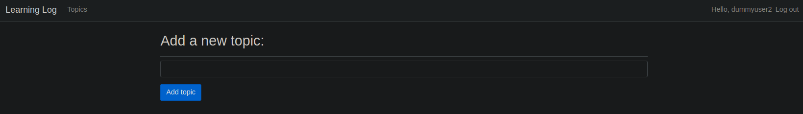
</div>

<div align=center margin=auto> 
  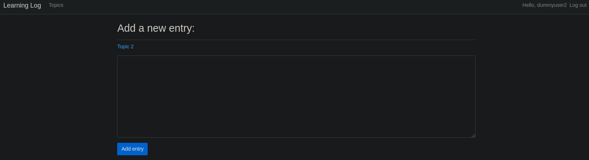
</div>

<div align=center margin=auto> 
  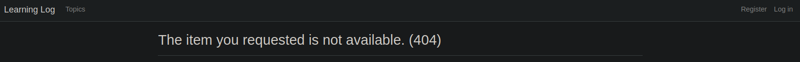
</div>

<div align=center margin=auto> 
  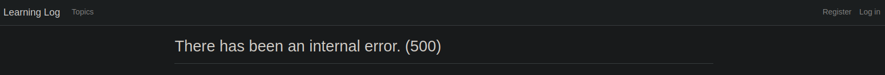
</div>


## Table of Contents
1. [Prerequisites](README.md#prerequisites)
2. [Installation on Linux](README.md#installation-on-linux)
    * [Standard dependencies](README.md#standard-dependencies)
    * [Repository import](README.md#repository-import)
    * [Project-specific dependencies](README.md#project-specific-dependencies)
3. [How to run locally](README.md#how-to-run-locally)


## Prerequisites
To run the app locally, you need the following components installed:

**Standard dependencies**
- Python 3.10
- Pip
- Git
- Pipenv (highly-recommended in this case, to avoid installing specific 
dependency versions required by the app system-wide; instead, dependecies 
are installed within a virtual environment dedicated to the app, and the 
environment ensures expected behavior of the app; also, automates dependency 
installation) 

**System-wide project-specific dependencies**
- python3-dev (psycopg2 dependency)
- libpq-dev (psycopg2 dependency)

**Project-wide project-specific dependencies**
- django (web framework for website development)
- django-bootstrap4 (bootstrap framework integration to create user interface)
- python-dotenv (to work with environment variables)
- psycopg2 (to use database on Heroku side)
- django-heroku (to configure web app for running on Heroku server)
- gunicorn (server providing access to web apps on Heroku server)


## Installation
PLEASE NOTE: instructions tested on Ubuntu; exact actions/commands may differ 
on other systems

### Standard dependencies
Please refer to the corresponding official sources for:
- Python: https://www.python.org/downloads/
- Pip: https://pip.pypa.io/en/stable/installation/
- Git: https://git-scm.com/book/en/v2/Getting-Started-Installing-Git
- Pipenv: https://pipenv.pypa.io/en/latest/

### Repository import
- Go to the directory you'd like to have this repository in and open the 
directory in terminal
- Enter the following command:

```
>>> git clone https://github.com/okharkevych/learning_log.git
```

### Project-specific dependencies
- To install system-wide dependencies, open terminal and enter the following 
command:

```
sudo apt-get install python3-dev libpq-dev
```

- To install project-wide dependencies, open learning_log directory downloaded 
earlier in terminal and enter the following commands:

```
>>> pipenv shell
>>> pipenv install
```


## How to run locally
- Open learning_log directory downloaded earlier in terminal

**Add a secret key environmental variable to allow the website to run**
- Enter the following commands:

```
>>> pipenv shell
>>> > ll_env/.env
>>> python -c 'from django.core.management.utils import get_random_secret_key; print(get_random_secret_key())'
```

- Copy the terminal output
- Open ll_env/.env file in a text editor of your choosing
- Write "SECRET_KEY=", than paste the terminal output
- Save changes to .env file

**Initialize local database**
- Enter the following command:

```
>>> python manage.py migrate
```

**Create super user**
- Enter the following command:

```
>>> python manage.py createsuperuser
```

**Run local server to host the website**
- Enter the following command:

```
>>> python manage.py runserver
```

- Terminal output will contain a line like 
"Starting development server at http://127.0.0.1:8000/"
- Open the link from the terminal in your browser
- Enjoy the app!
